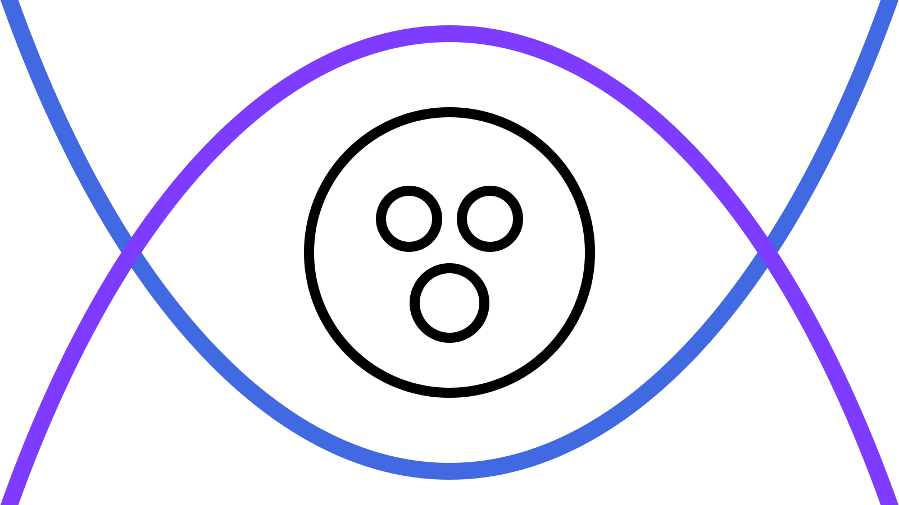

<p align="center">
  
</p>

# Vennbase

**Build multi-user apps without writing a single access rule.**

Vennbase is a TypeScript client-side database for collaborative, local-first web apps — with no backend to run, no server to pay for, and no access control rules to misconfigure. Users sign in with their [Puter](https://puter.com) account. Your app only sees the user's subset of the data stored in Puter.

```tsx
// Write
const board = db.create("boards", { title: "Launch checklist" }).value;
db.create("cards", { text: "Ship it", done: false, createdAt: Date.now() }, { in: board });

// Read (React)
const { rows: cards = [] } = useQuery(db, "cards", {
  in: board,
  orderBy: "createdAt",
  order: "asc",
});

// Share
const { shareLink } = useShareLink(db, board, { role: "editor" });
```

Write your frontend. Vennbase handles the rest.

- **Zero backend** — no server to run, no infrastructure bill
- **No access rules to write** — share a link, they're in; that's the whole model
- **Optimistic updates** — instant writes built-in
- **Local-first support** — app data syncs via CRDT automatically
- **NoSQL, open source**
- **Auth, server functions** — via Puter, one login for your whole app
- **User-pays AI** — Puter's AI APIs are billed to the user, not you; build AI features with zero hosting cost
- **Agent-friendly** — the explicit-grant model is simple enough that AI coding agents get it right first time

---

## How it works

Every piece of data in Vennbase is a **row**. A row belongs to a **collection** defined in your schema, holds typed fields, and has its own identity.

Rows can be **nested**. A `card` lives inside a `board`; a `recentBoard` lives inside the built-in `user` collection. The parent relationship defines visibility — gaining access to a parent automatically grants access to its children.

Access is **explicit-grant only**. To let someone into a row, generate a share link and send it to them. They accept it, they're in. There are no rule expressions to write and no policy surface to misconfigure.

---

## Install

```bash
pnpm add @vennbase/core
```

React apps: `pnpm add @vennbase/react @vennbase/core`.

---

## Schema

Define your collections once. TypeScript infers field types throughout the SDK automatically.

```ts
import { collection, defineSchema, field } from "@vennbase/core";

export const schema = defineSchema({
  boards: collection({
    fields: {
      title: field.string(),
    },
  }),
  recentBoards: collection({
    in: ["user"],
    fields: {
      boardRef: field.ref("boards").key(),
      openedAt: field.number().key(),
    },
  }),
  cards: collection({
    in: ["boards"],
    fields: {
      text: field.string(),
      done: field.boolean(),
      createdAt: field.number().key(),
    },
  }),
});

export type Schema = typeof schema;
```

- `collection({ in: [...] })` — `in` lists the allowed parent collections.
- `field.string()` / `.number()` / `.boolean()` / `.date()` / `.ref(collection)` — typed fields; chain `.key()`, `.optional()`, or `.default(value)` as needed

Fields are for metadata that you want to query. Mark structural/queryable fields with `.key()`. The canonical CRDT pattern is: row fields hold metadata and row refs, while the CRDT document holds the collaborative value state for that row.

---

## Setup

Create one `Vennbase` instance for your app and pass it an `appBaseUrl` so that share links point back to your app:

```ts
import { Vennbase } from "@vennbase/core";
import { schema } from "./schema";

export const db = new Vennbase({ schema, appBaseUrl: window.location.origin });
```

## Auth and startup

```tsx
import { useSession } from "@vennbase/react";

function AppShell() {
  const session = useSession(db);

  if (session.status === "loading") {
    return <p>Checking session…</p>;
  }

  if (!session.session?.signedIn) {
    return <button onClick={() => void session.signIn()}>Log in with Puter</button>;
  }

  return <App />;
}
```


---

## Creating rows

```ts
// Create a top-level row
const board = db.create("boards", { title: "Launch checklist" }).value;

// Create a child row — pass the parent row or row ref
db.create("cards", { text: "Write README", done: false, createdAt: Date.now() }, { in: board });
db.create("cards", { text: "Publish to npm", done: false, createdAt: Date.now() }, { in: board });
```

`create` and `update` are synchronous optimistic writes. Use `.value` on the returned receipt when you want the row handle immediately.

To update fields on an existing row:

```ts
db.update("cards", card, { done: true });
```

---

## Querying

Vennbase queries always run within a known scope. For `cards`, that scope is a `board`, so you pass `in: board`. For collections declared as `in: ["user"]`, omitting `in` means "use the current signed-in user's built-in `user` row."

Queries never mean "all accessible rows". If a collection is not declared as `in: ["user"]`, omitting `in` is an error.

### Imperative

```ts
// `recentBoards` is declared as `in: ["user"]`, so the current user scope is implicit.
const recentBoards = await db.query("recentBoards", {
  orderBy: "openedAt",
  order: "desc",
  limit: 10,
});
```

```ts
// Multi-parent queries run in parallel, then merge and sort their results
const cards = await db.query("cards", {
  in: [todoBoard, bugsBoard],
  orderBy: "createdAt",
  order: "asc",
  limit: 20,
});
```

### With React

`@vennbase/react` ships a `useQuery` hook that polls for changes and re-renders automatically:

```tsx
import { useQuery } from "@vennbase/react";

const { rows: cards = [], status } = useQuery(db, "cards", {
  in: board,
  orderBy: "createdAt",
  order: "asc",
});
```


---

## Sharing rows with share links

Access to a row is always explicit. There is no rule system to misconfigure — no typo in a policy expression that accidentally exposes everything. A user either holds a valid invite token or they don't.

In React, prefer `useShareLink(db, row, { role: "editor" })` for the sender and `useAcceptInviteFromUrl(db, ...)` for the recipient. Underneath, readable invites still follow the same three-step flow:

```ts
// 1. Generate a token for the row you want to share
const shareToken = db.createShareToken(board, "editor").value;

// 2. Build a link the recipient can open in their browser
const link = db.createShareLink(board, shareToken);
// → "https://yourapp.com/?db=..."

// 3. Recipient opens the link; your app calls acceptInvite
const sharedBoard = await db.acceptInvite(link);
```

If you do not need the token separately, you can create the link directly from a role:

```ts
const editorLink = db.createShareLink(board, "editor").value;
```

`acceptInvite` accepts either a full invite URL or a pre-parsed `{ ref, shareToken? }` object from `db.parseInvite(input)`. In React, `useAcceptInviteFromUrl(db, ...)` handles the common invite-landing flow for you.

For blind inbox workflows, create a submitter link instead:

```ts
const submissionLink = db.createShareLink(board, "submitter").value;
const joined = await db.joinInvite(submissionLink);
// joined.role === "submitter"
```

`"submitter"` members can create child rows under the shared parent and can run `db.query(..., { select: "keys" })` to see only anonymous key-field projections from sibling rows. Key-query results expose `id`, `collection`, and key fields only; they do not include row refs, base URLs, owners, or other locator metadata. Submitters still cannot read the parent row, fetch full sibling rows, inspect members, or use sync. Apps that need a submitter to revisit their own submissions should persist the created child refs separately.

---

## Membership

Once users have joined a row you can inspect and manage the member list:

```ts
// Flat list of usernames
const members = await db.listMembers(board);

// With roles
const detailed = await db.listDirectMembers(board);
// → [{ username: "alice", role: "editor" }, ...]

// Add or remove manually
await db.addMember(board, "bob", "editor").committed;
await db.removeMember(board, "eve").committed;
```

Membership inherited through a parent row is visible via `listEffectiveMembers`.

---

## Real-time sync (CRDT)

Vennbase includes a CRDT message bridge. Connect any CRDT library to a row and all members receive each other's updates in real time.

Sending CRDT updates requires `"editor"` access, but all members can poll and receive them.

In React, here is the recommended [Yjs](https://yjs.dev) integration:

```tsx
import * as Y from "yjs";
import { createYjsAdapter } from "@vennbase/yjs";
import { useCrdt } from "@vennbase/react";

const adapter = createYjsAdapter(Y);
const { value: doc, flush } = useCrdt(board, adapter);

// Write to doc normally, then push immediately when needed
await flush();
```

`@vennbase/yjs` uses your app's `yjs` instance instead of bundling its own runtime, which avoids the multi-runtime Yjs failure mode.

---

## Example apps

`packages/todo-app` is the code from this README assembled into a working app — boards, recent boards, cards, and share links. Run it with:

```bash
pnpm --filter todo-app dev
```

For a fuller picture of how the pieces fit together in a real app, read `packages/woof-app`. It uses CRDT-backed live chat, user-scoped history rows for room restore, child rows with per-user metadata, and role-aware UI — the patterns you'll reach for once basic reads and writes are working.

```bash
pnpm --filter woof-app dev
```

`packages/appointment-app` goes further into access-control territory: a blind booking inbox where customers can add rows without seeing each other, run anonymous slot-availability queries using `select: "keys"`, and schema design that controls exactly what key-only queries expose. Read [`PATTERNS.md`](./PATTERNS.md) for a recipe-style walkthrough of each pattern.

```bash
pnpm --filter appointment-app dev
```

---

## API reference

### `Vennbase`

| Method | Description |
|--------|-------------|
| `new Vennbase({ schema, appBaseUrl? })` | Create a Vennbase instance. Pass `appBaseUrl` so share links point back to your app. |
| `getSession()` | Check whether the current browser already has a Puter session. |
| `signIn()` | Start the Puter sign-in flow. Call this from a user gesture such as a button click. |
| `ensureReady()` | Explicitly await authentication and provisioning before mutations. Most useful in imperative startup flows and before imperative writes. |
| `whoAmI()` | Returns `{ username }` for the signed-in Puter user. |
| `create(collection, fields, options?)` | Create a row optimistically and return a `MutationReceipt<RowHandle>` immediately. Pass `{ in: parent }` for child rows, where `parent` can be a `RowHandle` or `RowRef`; for collections declared as `in: ["user"]`, omitting `in` uses the current signed-in user's built-in `user` row. Most apps use `.value`; await `.committed` when you need remote confirmation. |
| `update(collection, row, fields)` | Merge field updates onto a row optimistically and return a `MutationReceipt<RowHandle>` immediately. `row` can be a `RowHandle` or `RowRef`. |
| `getRow(row)` | Fetch a row by typed reference. |
| `query(collection, options)` | Load rows under a parent, with optional index, order, and limit. For collections declared as `in: ["user"]`, omitting `in` uses the current signed-in user's built-in `user` row. |
| `watchQuery(collection, options, callbacks)` | Subscribe to repeated query refreshes via `callbacks.onChange`. For collections declared as `in: ["user"]`, omitting `in` uses the current signed-in user's built-in `user` row. Returns a handle with `.disconnect()`. |
| `createShareToken(row, role)` | Generate a new share token for a row and return a `MutationReceipt<ShareToken>`. Pass a role such as `"editor"` or `"submitter"`. |
| `getExistingShareToken(row, role)` | Return the existing token for the requested role if one exists, or `null`. |
| `createShareLink(row, shareToken)` | Build a shareable URL containing a serialized row ref and token. |
| `createShareLink(row, role)` | Generate a new share token for that role and return the resulting share link as a `MutationReceipt<string>`. |
| `parseInvite(input)` | Parse an invite URL into `{ ref, shareToken? }`. |
| `joinInvite(input)` | Join a row via invite URL or parsed invite object without opening it, and return `{ ref, role }`. |
| `acceptInvite(input)` | Join a readable invite and return its handle. Use it for `"editor"`, `"contributor"`, or `"viewer"` invites; `"submitter"` invites should use `joinInvite(...)`. |
| `saveRow(key, row)` | Persist one current row for the signed-in user under your app-defined key. |
| `openSavedRow(key)` | Re-open the saved row for the signed-in user, or `null`. |
| `clearSavedRow(key)` | Remove the saved row for the signed-in user. |
| `listMembers(row)` | Returns `string[]` of all member usernames. |
| `listDirectMembers(row)` | Returns `{ username, role }[]` for direct members. |
| `listEffectiveMembers(row)` | Returns resolved membership including grants inherited from parents. |
| `addMember(row, username, role)` | Grant a user access and return a `MutationReceipt<void>`. Roles: `"editor"`, `"contributor"`, `"viewer"`, and `"submitter"`. `"editor"` can update fields, manage members, manage parents, and send CRDT messages; `"contributor"` can read the row and submit only rows they own under it; `"viewer"` is read-only; `"submitter"` is write-only for child creation under the shared parent. Inherited `"contributor"` access becomes `"viewer"` on descendants. |
| `removeMember(row, username)` | Revoke a user's access and return a `MutationReceipt<void>`. |
| `addParent(child, parent)` | Link a row to an additional parent after creation and return a `MutationReceipt<void>`. |
| `removeParent(child, parent)` | Unlink a row from a parent and return a `MutationReceipt<void>`. |
| `listParents(child)` | Returns all parent references for a row. |
| `connectCrdt(row, callbacks)` | Bridge a CRDT onto the row's message stream. Returns a `CrdtConnection`. |

### `RowHandle`

| Member | Description |
|--------|-------------|
| `.fields` | Current field snapshot, typed from your schema. Treat it as read-only; the object is replaced when fields change. |
| `.collection` | The collection this row belongs to. |
| `.ref` | Portable `RowRef` object for persistence, invites, ref-typed fields, and reopening the row later. |
| `.id` / `.owner` | Row identity metadata. |
| `.refresh()` | Re-fetch fields from the server. Resolves to the latest field snapshot. |
| `.connectCrdt(callbacks)` | Shorthand for `db.connectCrdt(row, callbacks)`. |
| `.in.add(parent)` / `.in.remove(parent)` / `.in.list()` | Manage parent links. |
| `.members.add(username, { role })` / `.members.remove(username)` / `.members.list()` | Manage membership. |

### `MutationReceipt<T>`

| Member | Description |
|--------|-------------|
| `.value` | The optimistic value available immediately. For `create` and `update`, this is the `RowHandle`. |
| `.committed` | Promise that resolves to the final value once the write is confirmed remotely. Rejects if the write fails. |
| `.status` | Current write status: `"pending"`, `"committed"`, or `"failed"`. |
| `.error` | The rejection reason after a failed write. Otherwise `undefined`. |
